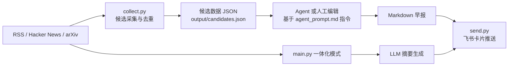

# AI News Bot

一个面向中文团队的每日 AI 资讯自动化机器人：采集多源新闻、生成结构化早报、推送到飞书。

## 项目特色（混合架构）

本项目支持两种运行方式：

- **纯 Python 一体化模式**：`main.py` 一次完成采集→整理→推送。
- **混合 Agent 模式**：`collect.py` 先产出候选数据，再由任意 Agent（或人工）编辑决策，最后 `send.py` 推送。

- **竞品自动追踪**：内置 43 个 AI Coding 和 AI Agent 竞品关键词，自动抓取并分类竞品动态。
- **图文早报与 X 观点**：尽可能使用原文 RSS 配图；配置飞书应用后嵌入卡片。配置 X API 后，从精选 AI 研究者和官方账号采集公开原帖。

这种混合架构兼顾了**稳定自动化**与**可控编辑能力**：采集和推送保持工程化，内容决策可灵活接入不同平台或工作流。

## 架构图（Mermaid）



## 早报板块结构

默认输出包含以下结构：

1. **AI 产品与工具**：新产品发布、重大更新、收购动态
2. **AI Coding 竞品动态**：Cursor / Windsurf / Claude Code / Copilot / Codex / Qoder 等编码工具动态
3. **AI Agent 竞品动态**：Manus / Lovable / v0 / Coze / Dify / WorkBuddy 等 Agent 平台动态
4. **📑 论文速览**：arXiv 精选论文，每篇一句话摘要
5. **数据与 AI 合规监管**：聚焦数据合规 / AI 治理 / AI 法案 / 版权问题
6. **今日焦点**：当日整体趋势的编辑点评
7. **筛选说明**：时效窗口、数据源、采集漏斗、剔除原因全透明

## 快速开始

### 1) 安装依赖

```bash
python -m venv .venv && source .venv/bin/activate
pip install -r requirements.txt
```

### 2) 配置环境变量

```bash
cp .env.example .env
```

按需填写 `.env`：

- `OPENAI_API_KEY`
- `OPENAI_BASE_URL`
- `OPENAI_MODEL`
- `FEISHU_WEBHOOK_URL`
- `FEISHU_APP_ID` / `FEISHU_APP_SECRET`（可选，卡片内嵌图片所需）
- `X_BEARER_TOKEN`（可选，X 帖子采集所需）

### 3) 运行方式 A：纯 Python 一体化

```bash
python main.py
```

常用参数：

```bash
python main.py --dry-run      # 本地预览 Markdown，不推送
python main.py --json --pretty
python main.py --test-webhook
```

### 4) 运行方式 B：混合 Agent 模式

```bash
python collect.py
# 产出 output/candidates.json 与 output/collect_stats.json

# 中间步骤：由 Agent 或人工根据 agent_prompt.md 进行筛选与改写，生成 Markdown 早报

python send.py /absolute/path/to/digest.md
```

> `agent_prompt.md` 是**平台无关**的编辑指令文档，可用于任意支持文本处理的 Agent/工作流。

## 数据源列表

当前内置来源包括：

- **RSS 媒体源**：TechCrunch AI、The Verge AI、Ars Technica、GitHub Blog AI、Vercel Blog、量子位(qbitai)、雷锋网(leiphone)、InfoQ AI
- **Hacker News**：基于 Algolia API，含 43 个竞品关键词（Cursor、Claude Code、Copilot、Dify、Coze 等）自动搜索
- **arXiv**：`cs.AI / cs.CL / cs.CV / cs.LG` 方向论文
- **网页抓取**：AI科技评论(atyun.com)，基于 BeautifulSoup 的结构化抓取
- **X 精选观点**：配置 X API 后，从精选 AI 研究者与官方团队账号获取公开原帖，附作者和原帖链接

可在 `src/config.py` 中扩展或调整来源与竞品关键词。

## 配置说明

核心配置项（环境变量）：

- `OPENAI_API_KEY`：LLM 调用密钥
- `OPENAI_BASE_URL`：OpenAI 兼容接口地址
- `OPENAI_MODEL`：摘要模型名
- `X_ACCOUNTS` / `X_MAX_POSTS`：X 账号名单和最多保留帖子数；使用 X 官方 recent-search API，账号名单可覆盖默认值
- `FEISHU_WEBHOOK_URL`：飞书机器人 Webhook
- `HTTP_TIMEOUT` / `HTTP_RETRIES`：采集请求超时与重试
- `LOOKBACK_HOURS` / `HN_MIN_POINTS` / `MAX_ITEMS_PER_SOURCE`：采集窗口与阈值

## 项目结构

```text
ai-news-bot/
├── src/
│   ├── collectors/          # 多源采集器
│   ├── summarizer/          # 摘要与结构化输出
│   ├── pusher/              # 飞书推送
│   └── config.py            # 配置中心
├── collect.py               # 采集阶段（混合模式）
├── send.py                  # 推送阶段（混合模式）
├── main.py                  # 一体化入口
├── agent_prompt.md          # 平台无关的编辑指令
├── .env.example             # 环境变量模板
├── requirements.txt
├── LICENSE
└── README.md
```

## 飞书推送效果说明

推送消息为飞书交互式卡片：

- 顶部显示日期与标题
- 各板块按分区展示，支持 Markdown 链接
- 「今日焦点」与「筛选说明」位于卡片尾部，便于快速浏览与追溯来源
- 原文有配图时附带图片链接；配置飞书应用凭据和上传图片权限后，最多三张图会直接嵌入卡片。图片上传失败时仍保留链接。
- X 观点单列展示，带作者账号和原帖链接；没有 X API 凭据时该来源自动跳过。

## License

本项目采用 **MIT License**，详见 `LICENSE`。
